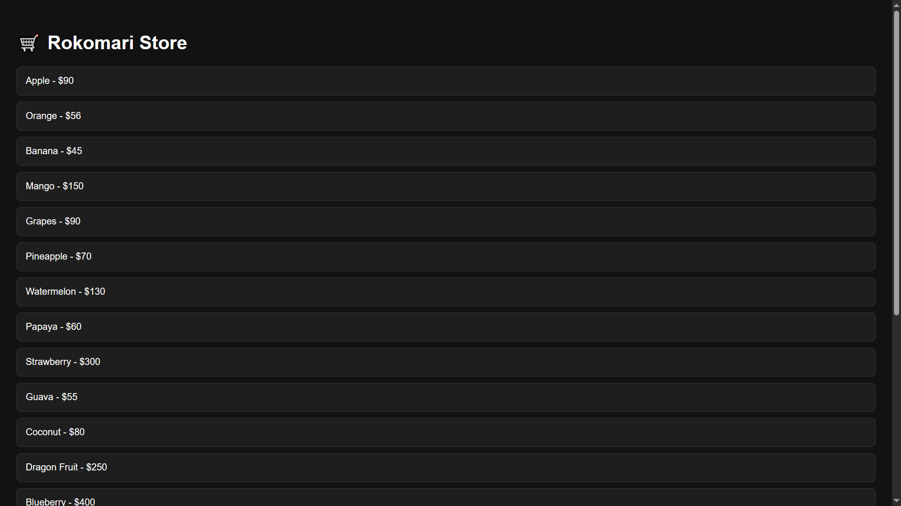

# Rokomari Fruits Store 🍎🍌🍊

Welcome to **Rokomari Fruits Store**, a simple web app where you can browse and select your favorite fruits. The app calculates the total price of your selected fruits and applies a discount if the total price exceeds a certain limit.

## Features 🚀
- Browse a list of fruits with their prices.
- Click on any fruit to add it to your basket.
- View the total price and any applicable discounts.
- A simple, intuitive user interface built using HTML, CSS, JavaScript and OOP.

## Demo 



## Installation 🔧

1. **Clone the repository:**
   ```bash
   git clone https://github.com/Khairul25556/rokomari-fruit-store.git
